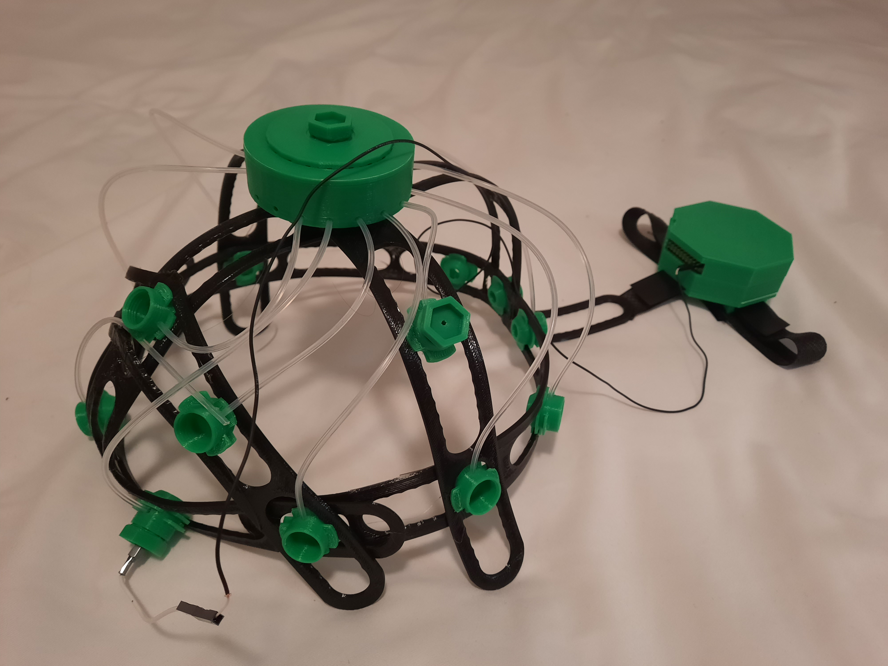
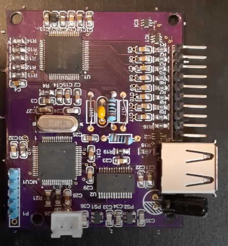

# MINT EEG Acquisition System: JellyFish 1.0

## Background
There are many commercially available EEG headsets such as MUSE, OpenBCI, Neurosky, and Emotiv. However, they have too high price, not enough electrodes for high EEG spatial-resolution, low signal quality, or too much time to set up. Over the last two years, MINT has mainly focused on the EEG board only. This year, we will integrate the EEG board into a complete EEG headset that is comfortable, adjustable, sturdy to be worn anytime and anywhere at a reasonable price so that EEG headset can become a common household device as a computer mouse.

## Overall Design

## Headset Design
One of the primary issues that needed to be tackled was being able to adjust the headset to various headsizes. On top of this, our headset needed to be able to conform to the 10-20 system for electrode placement. This was done by using three headbands that go across the head. These headbands each contain rails which the electrodes lock onto. Additionally, to deal with the various head circumferences available, an elastic band is placed across the forehead, attaching the two ends of the headset, allowing for various headsizes to be used with different elastic bands and allowing the headset remain stable. This allows for the electrodes to be placed anywhere along the head thus conforming to all head sizes.

In our final design it was determined that a fluid source was needed to ensure that the electrodes were saturated at all times in order to deliver the best result. This was done by creating a tank at the top of the head which holds said fluid. One key concern of having this fluid was that we knew that it would conduct the signal throughout the solution and with that, we needed to design a system that not only held the fluid but also distributed the solution separately to each electrode. From this, it was determined that a rotating mechanism was the best solution in that every couple hours an individual would need to rotate the lid to the holder in order to distribute the fluid.

In addition to the central fluid tank holder, another method for solution distribution has been made. In this solution, rather than having tubes branching from a central tank, each electrode would possess its own mini-tank that would easily connect and disconnect to refill (similar to filling a toy water gun). This method requires more testing. However if successful, may allow for more fluid to be stored in the system as a whole.

The final aspect to this headset is the board holder located in the back of the head. This unit combines both the battery for the circuit as well as the circuit board in a protected location with holes conveniently located for any required connections or buttons. Additionally, this boardbox will be wrapped in sheet metal to minimize any electromagnetic radiation that may be present in the area. This allows all processing and power of the headset to be located in one location. 

## Electrode
The wet electrode consists of a piece of cotton sandwich between the scalp and the pre-amplifier PCB board that acts as a bridge when saturated with the electrode solution. Active electrodes with pre-amplifiers allow for the signal acquired to be immediately boosted before additional noise is incorporated into the signal during the travel between the electrode and the system. The signal can be further increased by a screw on top of the electrode that increases the pressure between the cotton and the scalp when twisted. Handles on the sides of the electrode allows for the component to be mounted and slide on the headset frame for maximum flexibility.

## EEG Board: MENTHA 3.0
MENTHA 3.0 is an 8-channel EEG board. For more information, please check the MENTHA3.0_EEGBoard folder.

## Budget
Below is the rough breakdown of costs, for those who want to replicate this design:  
~0.5 CAD for consumable cotton pieces for each electrode  
~0.03 CAD for salt solution    
~1.50 CAD for fluid tank & board holder (PLA)  
~0.12 CAD for each electrode (PLA)  
~3.25 CAD for headset frame (TPU)  
~5.00 CAD for wires
~22 CAD for 3 PCBs
~150 CAD for components of one MENTHA 3.0 board
Total = 221 CAD

## About Us

JellyFish 1.0 was created by [(Multifaceted Innovation in NeuroTechnology](https://ubcmint.github.io/) (MINT), an undergraduate neurotech team, part of the group [Biomedical Engineering Student Team](http://www.ubcbest.com/) at the University of British Columbia in Vancouver, Canada.

JellyFish 1.0 was submitted as a project for the Fixed Challenge category of the [NeuroTechX 2020 Student Club competition](https://neurotechx.github.io/studentclubs/competition/).
