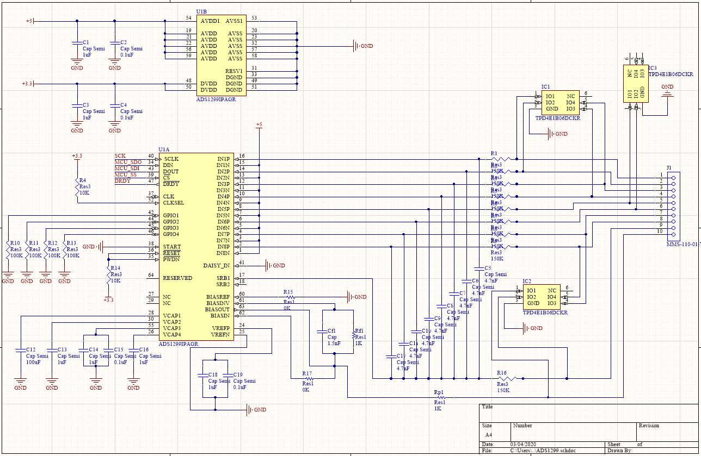
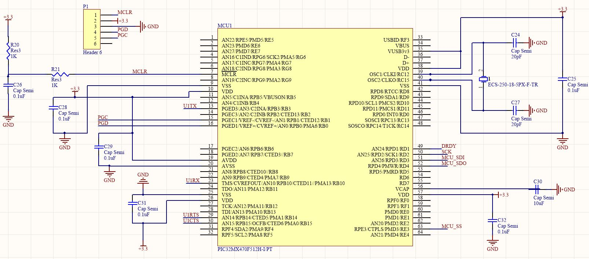
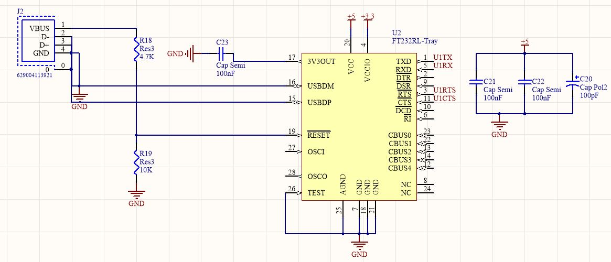

# MINT_EEGAcquisitionSystem: JellyFish 1.0

### Background
UBC MINT is developing an EEG Acquisition System for the 2020 NeurotechX competition Fixed Challenge. The goal is to design a board that can collect EEG potentials accurately and effectively. The system will utilize a PIC32MX microcontroller to send data acquired from the specialized biopotential measurement device (ADS1299) to a PC, where the data will be analyzed and live plotted.

The choice to use these components were based on research which showed the prevalence of the ADS1299 in literature. Additionally, MINT wanted to develop a smaller and more compact design than previous submissions.

## Electrical

### Initial concept
The initial concept was to use a similar approach as to previous years. That being implementing instrumentation amplifiers, along with active filters in order to acquire our signal. 

After testing with various amplifiers and topologies, performing some research, and receiving input from colleagues, the choice was made to use the ADS1299 chip with passive and software filters instead. The ADS1299 is low noise and can measure small voltages, which is important for biopotential measurements  

### ADS1299

We have set up the ADS 1299 with a referential montage and as such, each of the 8 input channels have the same reference electrode. We implemented a differential passive low pass filter at 160Hz (see bode plot). This lets us remove high frequency signals without introducing more noise to the system or losing signal in 10-50Hz rage. Furthermore, the differential set up of the filter rejects common signals between the electrode signal and the reference ground and therefore removes common noise and DC noise. The ADS1299 is connected to the microcontroller with and SPI interface.

Bode plots and frequency specifics?

### Microcontroller

The PIC32MX450/470 is being utilized for this project. The microcontroller was chosen due to its relatively fast clock speed, large memory size, and numerous peripheral pins. Additionally, Microchip offers easy solutions for programming and debugging using the PICkit3 and their MPLAB X IDE. The device is programmed using the PICKit3 through the pins labeled MCLR, PGD, and PGC. Attached to our MCU we have a 25MHz oscillator to set the clock speed, an FT232R USB UART IC for PC data transfer, connections to the ADS1299 through SPI, and the various required connections and decoupling capacitors.

To interface with a PC for data transfer, we have implemented an FT232R USB UART IC. This device connects to the UART peripherals of the PIC32 in order to transfer data to and from a PC with a wired USB-A connection. We have configured the FT232R chip in a self powered configuration as acording to the IC datasheet.

### Power Electronics

The Power electronics for the board offers two power rails using two voltage regulators. One is used to create a 5V rail from the input battery or power supply connection. The other is used to create a 3.3V rail and uses the 5V rail as an input.

## PCB Layout

### Note: 
Due to the global outbreak of COVID-19 the electrical sub team has been limited in our access to resources required to finish and test the electrical components of the EEG acquisition board.

## Software

### Board Firmware
Unfinished - see programminginfo.txt

### Data processing (PC)
Unfinished

### Note:
Due to the global outbreak of COVID-19 the electrical sub team has been limited in our access to resources required to finish the EEG acquisition board, and thus have been limited in firmware and software development.

## Budget
Below is the rough breakdown of costs, for those who want to replicate this design:

---
